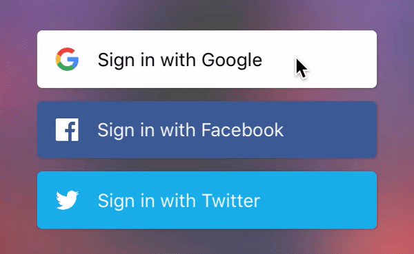

# EasySocialButton
An easy way to create beautiful social authentication buttons

## Screenshots



## Installation

### Cocoa Pods

```bash
pod 'EasySocialButton'
```

### Manual

Drag and drop ```AZSocialButton.swift``` to your project.

## Usage

### Interface Builder

Simply add a UIButton, and in the Identity Inspector change the class to `AZSocialButton`.

### Programmatically

```swift
let socialButton = AZSocialButton(frame: CGRect(x: 20, y: 20, width: 200, height: 40))

socialButton.animateInteraction = true
socialButton.useCornerRadius = true
socialButton.cornerRadius = 5
socialButton.highlightOnTouch = false
socialButton.image = #imageLiteral(resourceName: "ic_google")
socialButton.setTitle("Sign in with Google", for: [])
socialButton.setTitleColor(.black, for: [])
socialButton.titleLabel?.font = UIFont.systemFont(ofSize: 15)

socialButton.onClickAction = { (button) in
    print("do social login stuff")
}

view.addSubview(socialButton)
```
